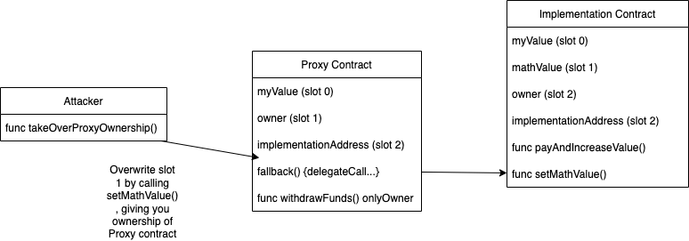

# Delegatecall Hack Using Single-call style

#### A delegatecall hack can occur when the Proxy contract using 'delegateCall' and its logic contract do not follow the same order of storage layout. This can result in its logic functions being exploited to change the value of the storage variables.

#### In the example code in this repo the Proxy contract has a logic contract named Implementation. The Implementation contract has a mathValue uint variable in place of its Slot 1 storage while the Proxy contract has an owner address variable in its Slot 1 storage. This is exploited by an Attacker contract that casts msg.sender to a uint and thus is able to call the Implementation.setMathValue through the Proxy contract and writes the address of msg.sender to Proxy.owner variable at Slot 1 thus changing the ownership of the Proxy contract & allowing for withdrawal of funds.

